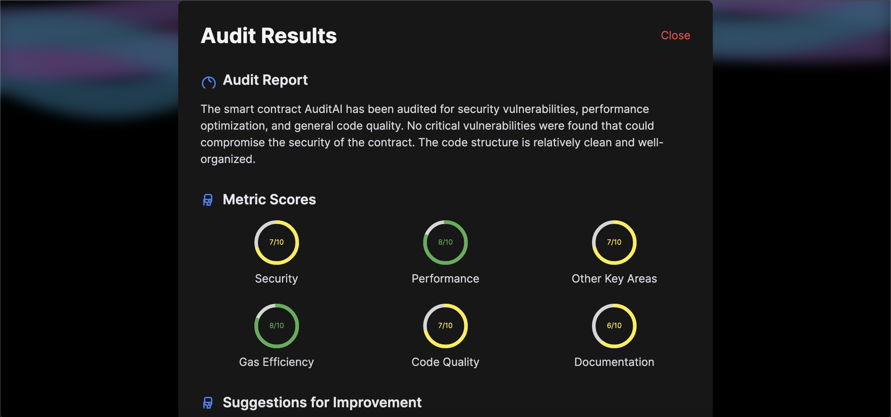

### AuditAI - AI Smart Contract Auditor

AuditAI is an innovative tool designed to leverage the power of AI to audit smart contracts. This project uses Chainlink Functions to connect to the OpenAI API for generating detailed audit reports and deploys the smart contract on the Avalanche Fuji Testnet.

<a href="" title="Project Screenshot">
    
</a>
<a href="" title="Project Screenshot">
    
</a>

### Table of Contents

- [Introduction](#introduction)
- [Features](#features)
- [Architecture](#architecture)
- [Setup and Deployment](#setup-and-deployment)
- [Usage](#usage)
- [Contributing](#contributing)
- [License](#license)

### Introduction

AuditAI provides an easy and efficient way to audit your smart contracts using AI. It interacts with the OpenAI API to analyze and generate detailed reports on the provided smart contract code, which are then emitted as events from the blockchain.

### Features

- **AI-Powered Auditing**: Leverages OpenAI to generate comprehensive audit reports.
- **ERC20 Token**: Includes a default ERC20 token (AuditAI Token).
- **Smart Contract Event Emission**: Emits audit events that can be tracked on the blockchain.
- **Deployed on Avalanche Fuji Testnet**: Utilizes Avalanche Fuji Testnet for deployment and interactions.
- **Chainlink Functions**: Uses Chainlink Functions to securely connect with the OpenAI API.
- **User-Friendly Interface**: Provides an easy-to-use frontend for auditing smart contracts.

### Architecture

1. **Smart Contract**: `AuditAI.sol`
2. **Frontend**: React-based user interface
3. **Blockchain Network**: Avalanche Fuji Testnet
4. **API Integration**: Chainlink Functions for OpenAI API

### Setup and Deployment

#### Prerequisites

- Node.js and npm installed
- MetaMask extension installed
- Avalanche Fuji Testnet setup in MetaMask
- Hardhat installed
- Ethers.js installed

#### Hardhat Configuration

Create a `hardhat.config.js` file in the root directory with the following content:

```javascript
require("@nomiclabs/hardhat-waffle");
require("@nomiclabs/hardhat-ethers");

module.exports = {
  solidity: "0.8.0",
  networks: {
    fuji: {
      url: "https://api.avax-test.network/ext/bc/C/rpc",
      accounts: [`0x${process.env.PRIVATE_KEY}`],
    },
  },
};
```

#### Steps

1. **Clone the Repository**

```bash
git clone https://github.com/yourusername/AuditAI.git
cd AuditAI
```

2. **Install Dependencies**

```bash
npm install
```

3. **Setup Environment Variables**

Create a `.env` file in the root directory with the following content:

```plaintext
NEXT_PUBLIC_API_KEY=your_openai_api_key
NEXT_PUBLIC_CONTRACT_ADDRESS=your_deployed_contract_address
PRIVATE_KEY=your_private_key
```

4. **Compile and Deploy Smart Contract**

Create a `scripts/deploy.js` file with the following content:

```javascript
async function main() {
  const [deployer] = await ethers.getSigners();
  console.log("Deploying contracts with the account:", deployer.address);

  const AuditAI = await ethers.getContractFactory("AuditAI");
  const auditAI = await AuditAI.deploy();

  console.log("AuditAI deployed to:", auditAI.address);
}

main()
  .then(() => process.exit(0))
  .catch((error) => {
    console.error(error);
    process.exit(1);
  });
```

Run the following command to compile and deploy the smart contract:

```bash
npx hardhat run scripts/deploy.js --network fuji
```

5. **Start the Frontend**

```bash
npm run dev
```

### Usage

1. **Connect Wallet**: Connect your MetaMask wallet to the Avalanche Fuji Testnet.
2. **Submit Contract Code**: Paste your smart contract code into the provided textarea and click "Analyze".
3. **View Results**: After analysis, view the detailed audit report and metrics in the modal that appears.

### Contributing

Contributions are welcome! Please fork the repository and submit a pull request for any improvements or bug fixes.

### License

This project is licensed under the MIT License.
